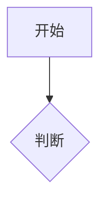

```markdown
# Markdown 完全指南

## 什么是Markdown？
一种轻量级标记语言，用纯文本编写结构化文档  
✓ 易读易写  
✓ 兼容所有文本编辑器  
✓ 可转换为HTML/PDF等多种格式

---

## 基础语法

### 1. 标题
```markdown
# 一级标题
## 二级标题
### 三级标题
（最多支持六级标题）
```

### 2. 段落
段落间空一行：
```
第一段落

第二段落
```

### 3. 强调
```
*斜体* 或 _斜体_  
**粗体** 或 __粗体__  
***粗斜体***  
~~删除线~~
```

### 4. 列表
无序列表：
```
- 项目1
- 项目2
  - 子项目（缩进2空格）
```

有序列表：
```
1. 第一项
2. 第二项
```

### 5. 链接与图片
```
[链接文字](https://example.com)

```

### 6. 代码
行内代码：`print("Hello")`

代码块：
````
```python
print("代码高亮")
```
````

---

## 扩展语法

### 1. 表格
```
| 标题1 | 标题2 |
|-------|-------|
| 内容1 | 内容2 |
```

### 2. 任务列表
```
- [x] 已完成
- [ ] 未完成
```

### 3. 脚注
```
正文[^1]
[^1]: 脚注说明
```

---

## 高级技巧

1. 转义字符：使用反斜杠 \*避免格式生效\*
2. HTML混用：直接插入`<div>`等HTML标签
3. 流程图支持（需特定解析器）：
````

````

---

## 工具推荐
- 编辑器：VS Code、Typora
- 在线工具：StackEdit、Dillinger
- 文档生成：MkDocs、Docsify

*最后更新：2023年10月 | 遵循CommonMark规范*
```
